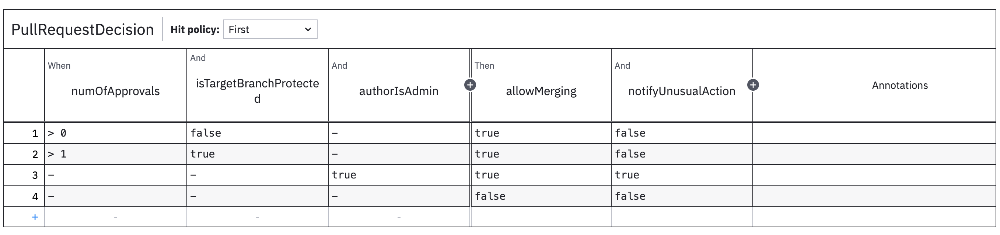

# Decisions4s


This repository contains a prototype of library helping in expressing business rules. It can be seen as an alternative
to Rules Engines or DMN.

The approach taken relies on higher-order data and follows DMN evaluation model, where each decision has specific
input & output types and consists of a set of rules that match on the input and produce the output.

## Getting Started

> [!NOTE]
> As of now Decisions4s don't have a single release. The example below assumes you released it yourself or you're
> contributing to the examples project.

We will model rules governing a pull request process. We start by defining the input and out of the decision.

```scala 3
import decisions4s.*

case class Input[F[_]](numOfApprovals: F[Int], isTargetBranchProtected: F[Boolean], authorIsAdmin: F[Boolean])
  derives HKD

case class Output[F[_]](allowMerging: F[Boolean], notifyUnusualAction: F[Boolean])
  derives HKD
```

We take 3 values as input and provide 2 values as the output. Now let's define the rules

```scala 3
def rules: List[Rule[Input, Output]] = List(
  Rule(
    matching = Input(
      numOfApprovals = it > 0,
      isTargetBranchProtected = it.isFalse,
      authorIsAdmin = it.catchAll,
    ),
    output = Output(
      allowMerging = true,
      notifyUnusualAction = false,
    ),
  ),
  Rule(
    matching = Input(
      numOfApprovals = it > 1,
      isTargetBranchProtected = it.isTrue,
      authorIsAdmin = it.catchAll,
    ),
    output = Output(
      allowMerging = true,
      notifyUnusualAction = false,
    ),
  ),
  Rule(
    matching = Input(
      numOfApprovals = it.catchAll,
      isTargetBranchProtected = it.catchAll,
      authorIsAdmin = it.isTrue,
    ),
    output = Output(
      allowMerging = true,
      notifyUnusualAction = true,
    ),
  ),
  Rule.default(
    Output(
      allowMerging = false,
      notifyUnusualAction = false,
    ),
  ),
)
```

We have defined 4 rules:

* unprotected branch requires 1 approval
* protected branch requires 2 approvals
* admin can merge anything without approvals but this sends a notification
* nothing can be merged otherwise

Now let's create a decision table

```scala 3
val decisionTable: DecisionTable[Input, Output] =
  DecisionTable(
    rules,
    inputNames = Name.auto[Input],
    outputNames = Name.auto[Output],
    name = "PullRequestDecision",
  )
```

Defining the decision means specifying the rules and names for fields and decision itself.

Now we can evaluate our decision:

```scala 3
decisionTable.evaluate(Input[Value](
  numOfApprovals = 1,
  isTargetBranchProtected = false,
  authorIsAdmin = true
))
// Output(allowMerging = true, notifyUnusualAction = false)
```
It works! Lets generate the DMN for the business.

```scala 3
import decisions4s.dmn.DmnConverter
val dmnInstance = DmnConverter.convert(decisionTable)
import org.camunda.bpm.model.dmn.Dmn
Dmn.writeModelToFile(new java.io.File(s"./${decisionTable.name}.dmn"), dmnInstance)
```

Now if we open this file in [bpmn.io](https://bpmn.io/toolkit/dmn-js/) or Camunda Modeler we will see the following table.



To see the full example check [PullRequestDecision.scala](decisions4s-examples/src/main/scala/decisions4s/example/docs/PullRequestDecision.scala)

## TODO:

* [ ] Defining hit policy - Currently decision table returns the first result, this can be customised to allow for at
  least collecting all the hits
* [ ] Release/CI/CD

## Non-features

The following items are currently not available, although they could be implemented if there is enough interest.

* **Serialization** - currently the decisions are not meant to be serialized and transferred over the wire, but it
  should be possible.
* **Effectful evaluation** - as of now, all the inputs are expected to be present at the time of evaluation. This could
  be extended for them to be lazily evaluated, so that rule can skip some expensive operations (e.g. network calls) if
  the decision is taken without them. This item has a high chance of being implemented through accepting IO as input and
  memoizing it. 