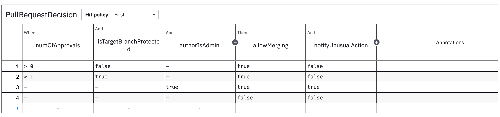

# Getting Started

To get a glimpse of what `Decisions4s` can do, we'll model rules governing a pull request process.

We want to define four rules:
* An unprotected branch requires 1 approval.
* A protected branch requires 2 approvals.
* An admin can merge anything without approvals, but this sends a notification.
* Nothing can be merged otherwise.

As the first step, add the following dependency to your project:

import SbtDependency from '@site/src/components/SbtDependency';

<SbtDependency moduleName={"decisions4s-core"}/>

## Defining the Rules

We start by defining the input and output of the decision:

```scala file=./main/scala/decisions4s/example/docs/PullRequestDecision.scala start=start_imports end=end_imports
```

```scala file=./main/scala/decisions4s/example/docs/PullRequestDecision.scala start=start_shapes end=end_shapes
```

We take three values as input and provide two values as output.
Both input and output are defined as case classes, with each field wrapped in the F[_] type parameter.
This pattern is sometimes referred to as Higher Kinded Data,
which is also the name of the typeclass automatically derived for our types.

Now let's define the rules:

```scala file=./main/scala/decisions4s/example/docs/PullRequestDecision.scala start=start_rules end=end_rules
```

And create a decision:

```scala file=./main/scala/decisions4s/example/docs/PullRequestDecision.scala start=start_table end=end_table
```

By doing this, we specified a name that will be used for the generated diagram.
We also defined the [hit policy](features/hit-policies), which in our case will capture the first satisfied rule.

## Evaluating the Decision

Now we can evaluate our decision:

```scala file=./main/scala/decisions4s/example/docs/PullRequestDecision.scala start=start_evaluate end=end_evaluate
```

It works!

## Understanding the decision

But you might wonder why the given decision was made. Wonder no more!

```scala file=./main/scala/decisions4s/example/docs/PullRequestDecision.scala start=start_diagnose end=end_diagnose
```

Which gives us the following:

```text file=./test/resources/docs/pull-request-diagnostics.txt
```

This not only tells us which rules were satisfied but also shows the results of specific predicates.
This way, we can easily understand what happened!

## Visualizing the Logic

Let's see how our logic presents itself in a more concise and human-friendly way.
We can render the decision as a DMN diagram and share it as a self-contained URL.
First, add the DMN dependency:

<SbtDependency moduleName={"decisions4s-dmn"}/>

Then call `shareUrl()` on the rendered model:

```scala file=./main/scala/decisions4s/example/docs/PullRequestDecision.scala start=start_dmn_share end=end_dmn_share
```

import shareUrl from '!!raw-loader!../../decisions4s-examples/src/test/resources/docs/pull-request-share-url.txt';

For the rules defined above, this produces:

<a href={shareUrl} target="_blank" rel="noopener" style={{wordBreak: 'break-all'}}>
  <code>{shareUrl}</code>
</a>

The DMN XML is deflate-compressed and base64url-encoded into the URL fragment, so no server stores the content — anyone with the link sees the same diagram:

<!-- TODO this should be autogenerated in the pipeline -->


This can now be shared with non-technical folks or saved as documentation.
See [Visualisations](features/visualising) for the full list of rendering options, including Markdown, raw DMN XML, and offline PNG.