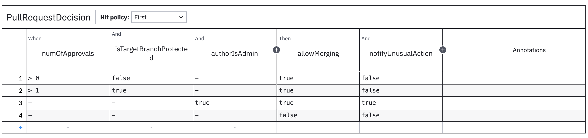

# Getting Started

To get a glimpse of what `Decisions4s` can do we will model rules governing a pull request process.

We want to define four rules:
* Unprotected branch requires 1 approval
* Protected branch requires 2 approvals
* Admin can merge anything without approvals but this sends a notification
* Nothing can be merged otherwise

As a first step, we need to add the following dependency to our your project.

import SbtDependency from '@site/src/components/SbtDependency';

<SbtDependency moduleName={"decisions4s-core"}/>

## Defining the rules

 We start by defining the input and out of the decision.

```scala file=./main/scala/decisions4s/example/docs/PullRequestDecision.scala start=start_imports end=end_imports
```

```scala file=./main/scala/decisions4s/example/docs/PullRequestDecision.scala start=start_shapes end=end_shapes
```

We take three values as input and provide two values as the output.
Both input and output are defined as case classes where each field is wrapped in `F[_]` type parameter.
This pattern is sometimes referred to as Higher Kinded Data,
and that's also the name of the typeclass that gets automatically derived for our types.

Now let's define the rules.

```scala file=./main/scala/decisions4s/example/docs/PullRequestDecision.scala start=start_rules end=end_rules
```

And create a decision

```scala file=./main/scala/decisions4s/example/docs/PullRequestDecision.scala start=start_table end=end_table
```

By doing this, we specified a name that will be used for the generated diagram.
We also defined the [hit policy](features/hit-policies) that in our case will capture the first satisfied rule.

## Evaluating the decision

Now we can evaluate our decision:

```scala file=./main/scala/decisions4s/example/docs/PullRequestDecision.scala start=start_evaluate end=end_evaluate
```

It works!

## Generating the diagram

Let's generate the DMN diagram that can be read by the business. To do this, we need to add another dependency.

<SbtDependency moduleName={"decisions4s-dmn"}/>

And use the provided utilities.

```scala file=./main/scala/decisions4s/example/docs/PullRequestDecision.scala start=start_dmn end=end_dmn
```

Now if we open this file in [bpmn.io](https://bpmn.io/toolkit/dmn-js/) or Camunda Modeler, we will see the following
table.

<!-- TODO this should be autogenerated in the pipeline -->


This can now be shared with non-technical folks or be saved as documentation!
